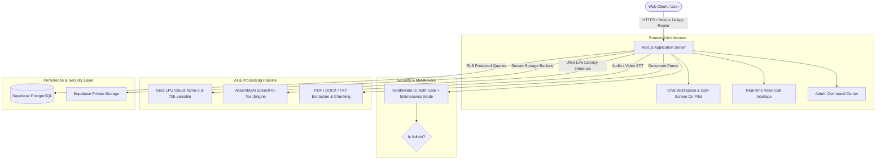

# ⚡ Sona AI — Intelligent Multi-Persona AI Workspace

> **Transforming information into deep understanding, multi-modal synthesis, and real-time intelligence.**  
> Powered by **Groq LPU™ ultra-low latency inference**, **AssemblyAI**, **Next.js 14 (App Router)**, and **Supabase**.

---

## 👥 Project Leadership & Team

- **Project Owner / Lead:** [Christian01-del](https://github.com/Christian01-del)
- **AI & Backend Developer:** [reactjay](https://github.com/reactjay)

---

## 🌟 Overview & Vision

**Sona AI** is an advanced, persona-driven artificial intelligence platform designed to revolutionize how students, researchers, business professionals, and creators interact with high-density documents, multimedia, and complex knowledge.

Unlike traditional single-purpose chat interfaces, Sona AI unifies **ultra-fast LPU inference**, **split-screen document intelligence with interactive citations**, **real-time conversational voice calls**, and **enterprise-grade administrative controls** into a cohesive, high-performance workspace.

---

## 🚀 Key Features

### 1. 🧠 Multi-Persona Cognitive Modes
Tailor the AI's reasoning depth, tone, and contextual tools based on your specific task:
- **Student Mode:** Socratic explanations, flashcards, breakdown of formulas, and study guides.
- **Business Mode:** Executive summaries, actionable memos, strategic SWOT analysis, and ROI metrics.
- **Creator Mode:** Scriptwriting, viral hooks, storytelling frameworks, and marketing copy.
- **Reading Mode:** Deep-dive document analysis, thematic breakdowns, and chapter synthesis.
- **General Mode:** Fast, unrestricted, all-around conversational intelligence.

### 2. 📄 Interactive Split-Screen Document Co-Pilot
- **Side-by-Side Analysis:** View the uploaded document (PDF/DOCX/TXT) on the left while conversing with Sona AI on the right.
- **Direct Paragraph Citations:** Click any citation badge in the AI response to auto-scroll and highlight the exact source paragraph in the document pane, eliminating LLM hallucinations.

### 3. 🎙️ Real-Time Conversational Voice Call
- Low-latency, hands-free conversational voice mode powered by web speech synthesis and Groq LPU processing.
- Live audio waveform visualizer, instant transcription, and automatic conversation turn-taking.

### 4. 🎧 Multimodal Speech-to-Text Ingestion
- Upload audio/video lectures, meetings, and voice memos.
- Transcribed with high accuracy via **AssemblyAI** and automatically indexed into the active workspace context.

### 5. 🛡️ Enterprise Admin Command Center & Maintenance Mode
- **Live Metrics:** Real-time analytics for users, active sessions, audio logs, and API health.
- **User Management:** Search, view, and promote user permissions with server-side role gating.
- **Audit Logging:** Comprehensive tracking of administrative actions and security events.
- **Maintenance Mode with Admin Bypass:** Put the application into maintenance mode for public users while administrators retain full access for testing and verification.

---

## 🏗️ Technical Architecture



---

## 💻 Tech Stack

| Layer | Technology | Purpose |
|---|---|---|
| **Frontend Framework** | Next.js 14 (App Router) | Server Components, Streaming SSR, Optimized routing |
| **Language** | TypeScript | Strict type-safety across all components, APIs, and schemas |
| **Styling** | Tailwind CSS + Lucide Icons | Responsive modern design, smooth transitions, glassmorphism |
| **Database & Auth** | Supabase (PostgreSQL) | Row Level Security (RLS), OAuth/Email Auth, Realtime DB |
| **AI Inference** | Groq Cloud LPU™ | Sub-second inference via `llama-3.3-70b-versatile` |
| **Speech Processing** | AssemblyAI + Web Speech API | High-accuracy transcription & bidirectional voice loop |
| **Document Processing**| pdf-parse, mammoth | Robust parsing of PDFs, Word docs, and plain text |

---

## ⚡ Quick Start & Local Setup

### 1. Prerequisites
- **Node.js** v18.17.0+ (or v20+)
- **npm** or **pnpm**
- A **Supabase** project
- A **Groq Cloud API Key**
- An **AssemblyAI API Key** (optional, for audio transcription)

### 2. Clone the Repository
```bash
git clone https://github.com/orbit-flow-labs/SUNO-AI.git
cd SUNO-AI
```

### 3. Install Dependencies
```bash
npm install
```

### 4. Configure Environment Variables
Copy `.env.example` to `.env.local`:
```bash
cp .env.example .env.local
```

Fill in your configuration:
```env
# Supabase Configuration
NEXT_PUBLIC_SUPABASE_URL=https://your-project.supabase.co
NEXT_PUBLIC_SUPABASE_ANON_KEY=your-anon-key
SUPABASE_SERVICE_ROLE_KEY=your-service-role-key

# AI Inference (Groq Cloud LPU)
GROQ_API_KEY=gsk_your_groq_api_key

# Speech-to-Text (AssemblyAI)
ASSEMBLYAI_API_KEY=your_assemblyai_key

# Public App URL
NEXT_PUBLIC_APP_URL=http://localhost:3000
```

### 5. Run Database Migrations
Execute the migrations in your Supabase SQL Editor in order:
1. `supabase/migrations/0001_init.sql` (Tables, RLS policies, Storage buckets, Core triggers)
2. `supabase/migrations/0002_admin_enhancements.sql` (Admin audit logs, composite indexes, avatar triggers)

### 6. Start the Development Server
```bash
npm run dev
```
Open [http://localhost:3000](http://localhost:3000) in your browser.

---

## 👑 Granting Administrator Privileges

To grant an account admin access (for accessing `/admin` and bypassing maintenance mode):

```sql
UPDATE profiles 
SET is_admin = true 
WHERE email = 'admin@yourdomain.com';
```

---

## 📚 Detailed Documentation

For judges, developers, and evaluators, detailed sub-documentation is available:

- 📖 **[Hackathon Judges Guide](docs/HACKATHON_JUDGES_GUIDE.md)** — Comprehensive review guide, evaluation criteria, and feature demonstrations.
- 🏛️ **[System Architecture](docs/ARCHITECTURE.md)** — Deep dive into the data flow, AI fallback strategies, and security design.
- 🚀 **[Deployment Guide](docs/DEPLOYMENT_GUIDE.md)** — Step-by-step instructions for production deployment on Vercel and Supabase.
- 🔒 **[Security & Performance](docs/SECURITY_AND_PERFORMANCE.md)** — Analysis of RLS enforcement, zero secret leakage, and sub-second latency optimizations.

---

## 🛡️ Security & Privacy Assurance

- **Zero Secret Leakage:** No private API keys or service role tokens are ever transmitted to the client bundle or printed to console logs.
- **Row Level Security (RLS):** Every database table is protected with strict PostgreSQL RLS policies ensuring users can only read and modify their own data.
- **Server-Side Authorization:** All administrative endpoints (`/api/admin/*`) independently verify user session and `is_admin` status on the server before processing.

---

## 📄 License

This project was built for hackathon demonstration. All rights reserved by **Christian01-del** and **reactjay**.
